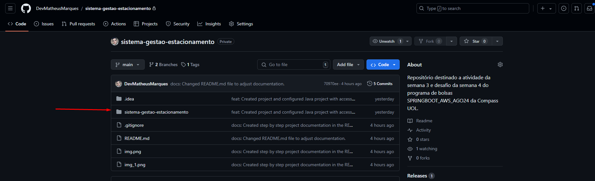
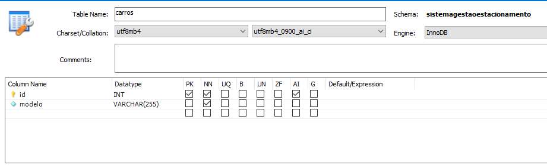

# Projeto Sistema de Gestão de Estacionamento (Atividade 3 e Desafio Semana 04) -  SPRINGBOOT_AWS_AGO24

Este projeto tem como objetivo atender as exigências da ativiadade da semana 03 e do desafio da semana 04 do programa de bolsas da Compass UOL.

### Observação
A estrutura do projeto aqui no repositório do GitHub esta com o projeto dentro de uma subpasta devido a atividade 3 que solicitava que fosse criada uma branch para a atividade 3 antes de criar o projeto.



## Requisitos
Certifique-se de ter as seguintes ferramentas instaladas:

- Java Development Kit (JDK) 21 ou superior.
- IDE para trabalhar com Java.
- MYSQL versão LTS 8.4.0.
- Conector do Java versão 8.4.0 (mysql.connector.j) - Utilizado gerenciador de pacotes Maven para instalação do conector ao projeto.

## Configuração do Projeto e Banco de Dados
Siga os passos abaixo para configurar o projeto em seu ambiente de testes:

1. **Clone o repositório**

   ```bash
   git clone https://github.com/DevMatheusMarques/sistema-gestao-estacionamento.git
   cd nome-do-diretorio
   ```
   
2. **Configuração do projeto**:

   Observe a estrutura de pastas do projeto e encontre a pasta resources. Ela vai estar no seguinte caminho:
    ```bash
   cd sistema-gestao-estacionamento/src/main
   ```
   Nesta pasta você vai encontrar um arquivo db.properties. Este arquivo contem a configuração das propriedades de acesso ao banco de dados. Como neste exemplo da figura a seguir:
   
    

    Você deve alterar as seguintes variáveis:
   - user
   - password
   
   Essas variaveis representam o respectivo nome e senha da sua conexão do banco de dados mysql. Você deve inserir os dados conforme o nome e senha que estiver em sua máquina.


3. **Criação do Banco de Dados do Projeto**

   Abra seu MySQL Workbench, acesse sua conexão e crie um banco de dados com o seguinte nome:
   ```bash
   SistemaGestaoEstacionamento
   ```
   Dentro deste banco crie uma tabela com o seguinte nome:
   ```bash
   carros
   ```
   Esta tabela deve conter as seguintes colunas:

   - id (Sendo chave primária, não podendo ser inserido valores nulos e contendo auto incremento)
   - modelo (Não podendo ser inserido valores nulos)
   
   Conforme a imagem a seguir:

    


4. **Executar o projeto (Classe Main)**

   Acesse o projeto e procure pela classe Main. Ela vai estar no seguinte caminho:
   ```bash
   cd sistema-gestao-estacionamento/src/main/java/org.compass/application
   ```
   Selecione a classe main e execute a opção de Run 'Main.java' em sua IDE.


### Contato
Em caso de dúvidas ou problemas, entre em contato com:

* Nome: Matheus Marques
* Email: devmatheusmarques@gmail.com
* GitHub: github.com/DevMatheusMarques
